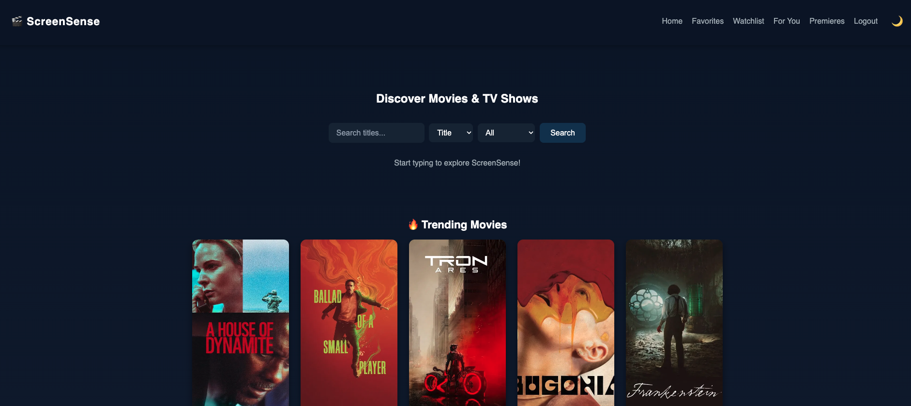
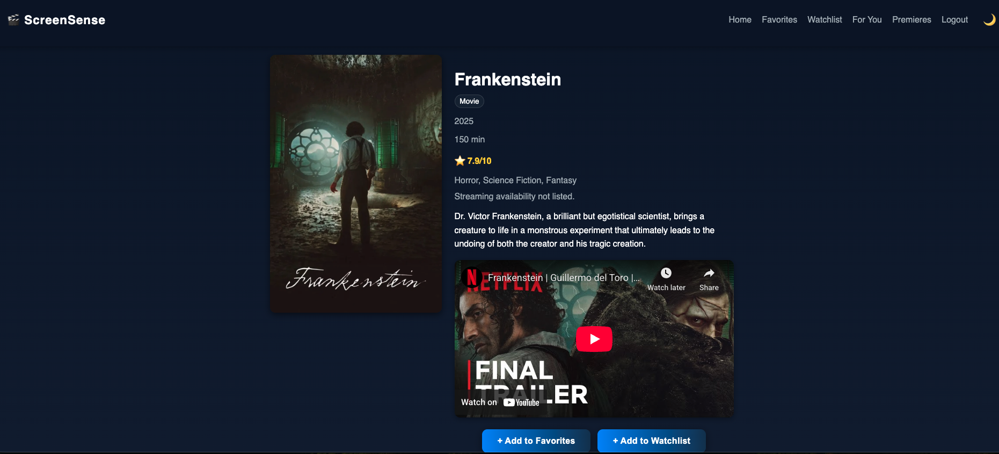
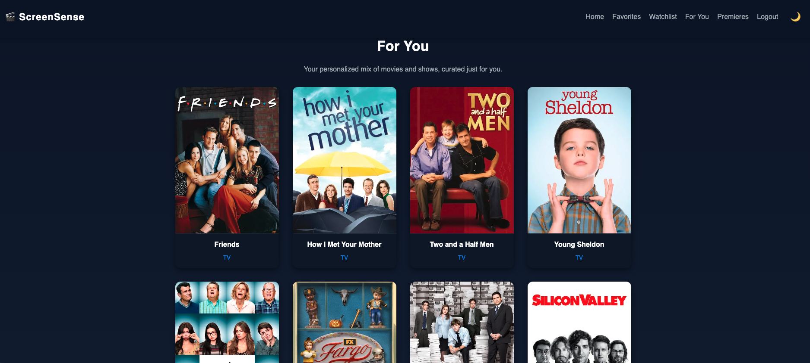

<h1 align="center">🎬 ScreenSense – Movie & TV Discovery App</h1>

---

## 🎥 About the App

**ScreenSense** is a Django-based web application that helps users discover, explore, and track movies and TV shows using the [TMDB API](https://www.themoviedb.org/documentation/api).

Visitors can browse trending titles, search for specific shows or movies, and view detailed information.

Users can create personalized experiences by signing up or logging in to manage their own favorites and watchlists, watch trailers, check streaming availability, and explore upcoming premieres. They also receive intelligent recommendations based on their saved preferences.

The app was built to make movie discovery smarter and more personalized — combining clean design, curated data, and AI-style recommendation logic to make entertainment discovery enjoyable and simple.

---

## 🚀 Live Demo

👉 **[View Deployed App](https://screensense-app-382a97c850d7.herokuapp.com/)**  
📋 **[Trello Board – Planning](https://trello.com/b/ypQfmlVJ/screensense)**  
💻 **[Project Repository – ScreenSenseApp](https://github.com/Diana961216/ScreenSenseApp)**  
🗂️ **[Planning Repository – ScreenSense-Planning](https://github.com/Diana961216/ScreenSense-Planning-)**

---

## ⚙️ Technologies Used

- **Frontend:** HTML5, CSS3, Django Templates
- **Backend:** Python 3.13, Django 5, TMDB API
- **Database:** SQLite (development), PostgreSQL (Heroku production)
- **Deployment:** Heroku with Gunicorn & Whitenoise
- **Other Tools:** Pipenv, dj-database-url, python-dotenv

---

## ✅ Current Features

- 🔍 **Search titles** – users can search for movies or TV shows via TMDB API
- 🔥 **Trending titles** – discover what’s popular right now
- 🎬 **Trailer integration** – official trailers viewable directly within the app
- 🌐 **Streaming availability** – see where a movie or show is available to stream (e.g., Netflix, Prime Video)
- 📅 **Upcoming premieres** – view upcoming releases with release dates (no reminders)
- ❤️ **Favorites** – save and manage your favorite titles
- 📺 **Watchlist** – keep track of shows and movies you plan to watch
- 🧠 **Recommendation system** – intelligent suggestions based on your saved favorites (simplified version implemented)
- 🔐 **Authentication system** – secure signup, login, and logout
- 🌙 **Light/Dark mode toggle** – switch instantly between themes
- 💾 **Persistent PostgreSQL database** – live storage on Heroku
- 🎨 **Responsive design** – fully optimized for desktop and mobile
- 🧩 **Admin dashboard** – Django admin for database and user management

---

## 🚀 Stretch Goals / Future Enhancements

- 🤖 **Smarter adaptive recommendations** – machine learning to improve personalization over time
- 💬 **User reviews and ratings** – allow users to comment and rate titles
- 🔗 **Shareable title links** – share movies and shows directly from the app
- 🧭 **Enhanced filtering and sorting** – sort favorites/watchlist by genre, release year, or rating
- 🗂️ **Genre-based browsing** – explore titles by genre instead of only keyword search
- 💬 **Social interaction features** – follow or like other users’ lists

---

## 💡 Highlights & Challenges

- Integrated multiple TMDB endpoints (details, search, trending, and videos)
- Built live streaming availability and trailer features using TMDB data
- Deployed a dynamic recommendation system based on user favorites
- Successfully connected PostgreSQL via Heroku add-on and configured production environment
- Implemented responsive UI and dark/light theming

---

## 📸 Screenshots

| Home Page                                                       | Movie Details                                               | Recommendations                                       |
| --------------------------------------------------------------- | ----------------------------------------------------------- | ----------------------------------------------------- |
|  |  |  |

---

## Attributions

- [TMDB API](https://www.themoviedb.org/documentation/api) – Movie and TV show data
- [Heroku](https://www.heroku.com/) – Hosting and PostgreSQL database
